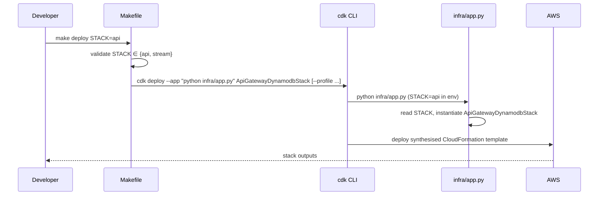

# Design Document: cdk-deploy-destroy-targets

## Overview

This feature adds `deploy` and `destroy` Make targets to the project Makefile, and a CDK app entry point (`infra/app.py`) that selects a single stack based on a `STACK` environment variable. Developers can run `make deploy STACK=api` or `make destroy STACK=stream` without knowing CDK CLI syntax or full stack construct IDs.

The two moving parts are:

1. `infra/app.py` — a minimal CDK app that reads `STACK` from the environment and instantiates only the requested stack.
2. Two new Makefile targets (`deploy`, `destroy`) that validate the `STACK` argument, build the CDK CLI invocation, and forward an optional `AWS_PROFILE`.

## Architecture



The Makefile is the sole entry point for developers. It owns argument validation and CDK CLI flag construction. `infra/app.py` is a thin adapter that maps the `STACK` env var to a stack class.

## Components and Interfaces

### 1. `infra/app.py` — CDK App Entry Point

Reads `STACK` from `os.environ`, looks it up in a registry dict, and calls `app.synth()`.

```
STACK_REGISTRY: dict[str, type[Stack]] = {
    "api":    ApiGatewayDynamodbStack,
    "stream": DynamodbStreamStack,
}
```

- If `STACK` is missing or not in the registry → `sys.exit(1)` with a descriptive message.
- If `STACK` is valid → instantiate the stack with a fixed construct ID derived from the class name, then synth.

The construct ID passed to each stack is the class name (e.g. `ApiGatewayDynamodbStack`). This is the identifier that `cdk deploy` / `cdk destroy` targets.

### 2. Makefile targets

#### Stack name → CDK construct ID mapping

A Makefile associative array (or conditional block) maps short names to CDK construct IDs:

```makefile
STACK_MAP_api    = ApiGatewayDynamodbStack
STACK_MAP_stream = DynamodbStreamStack
CDK_STACK        = $(STACK_MAP_$(STACK))
```

Adding a new stack requires one new `STACK_MAP_<name>` line.

#### `deploy` target

```
deploy:
    @[ -n "$(STACK)" ] || { echo "Usage: make deploy STACK=<api|stream>"; exit 1; }
    @[ -n "$(CDK_STACK)" ] || { echo "Error: unknown stack '$(STACK)'"; exit 1; }
    STACK=$(STACK) cdk deploy --app "python infra/app.py" $(CDK_STACK) \
        $(if $(AWS_PROFILE),--profile $(AWS_PROFILE),)
```

#### `destroy` target

Same shape as `deploy` but calls `cdk destroy --force`.

#### Profile forwarding

Both targets use `$(if $(AWS_PROFILE),--profile $(AWS_PROFILE),)` so the flag is only appended when the variable is non-empty.

## Data Models

No persistent data models are introduced. The only runtime data is:

| Name | Type | Source | Description |
|---|---|---|---|
| `STACK` | `str` | env var / Make variable | Short stack name (`api` or `stream`) |
| `AWS_PROFILE` | `str` (optional) | Make variable | Named AWS CLI profile |
| `CDK_STACK` | `str` | Makefile expansion | Full CDK construct ID derived from `STACK` |
| `STACK_REGISTRY` | `dict[str, type[Stack]]` | `infra/app.py` | Maps short name → stack class |

## Correctness Properties

*A property is a characteristic or behavior that should hold true across all valid executions of a system — essentially, a formal statement about what the system should do. Properties serve as the bridge between human-readable specifications and machine-verifiable correctness guarantees.*

After prework analysis, requirements 1.1, 2.1, 4.1, and 4.2 all express the same invariant (valid name → correct class instantiated) and are consolidated into Property 1. Requirements 1.2, 1.3, 2.2, 2.3, and 4.3 all express the same invariant (invalid/missing name → non-zero exit) and are consolidated into Property 2. Requirements 3.1 and 3.2 are registry membership checks consolidated into a single example.

### Property 1: Valid stack name instantiates exactly the correct stack class

*For any* `(name, cls)` pair in `STACK_REGISTRY`, running `infra/app.py` with `STACK=name` must produce a CDK `App` whose stack list contains exactly one stack and that stack is an instance of `cls`.

**Validates: Requirements 1.1, 2.1, 3.1, 3.2, 4.1, 4.2**

### Property 2: Invalid or missing STACK causes non-zero exit

*For any* string that is not a key in `STACK_REGISTRY` (including the empty string), running `infra/app.py` with that value as `STACK` must raise `SystemExit` with a non-zero code and emit a descriptive error message.

**Validates: Requirements 1.2, 1.3, 2.2, 2.3, 4.3**

## Error Handling

| Scenario | Location | Behaviour |
|---|---|---|
| `STACK` not provided to `make deploy/destroy` | Makefile | Print usage message, `exit 1` |
| `STACK` value not in Makefile map | Makefile | Print "unknown stack" error, `exit 1` |
| `STACK` env var missing in `infra/app.py` | `infra/app.py` | `sys.exit(1)` with message |
| `STACK` env var unrecognised in `infra/app.py` | `infra/app.py` | `sys.exit(1)` with message listing valid names |
| `cdk deploy/destroy` fails | CDK CLI / shell | Non-zero exit propagates naturally (no `|| true`) |

The Makefile and the CDK app both validate `STACK` independently. The Makefile check is the first line of defence (fast, no Python startup cost); the app check is the safety net when the app is invoked directly.

## Testing Strategy

### Unit tests (`tests/infra/test_app.py`)

Focus on concrete examples and edge cases using `pytest` and `monkeypatch`:

- Example: `STACK=api` → app contains exactly one stack, instance of `ApiGatewayDynamodbStack`.
- Example: `STACK=stream` → app contains exactly one stack, instance of `DynamodbStreamStack`.
- Example: `STACK` unset → `SystemExit` raised with non-zero code.
- Example: `STACK=unknown` → `SystemExit` raised with non-zero code.
- Example: registry keys are exactly `{"api", "stream"}` (validates 3.1, 3.2).

### Property-based tests (`tests/infra/test_app_properties.py`)

Use **Hypothesis** (already a dev dependency). Each property test runs a minimum of 100 iterations.

Each test is tagged with a comment:
`# Feature: cdk-deploy-destroy-targets, Property <N>: <property_text>`

- **Property 1** — `@given(st.sampled_from(list(STACK_REGISTRY.items())))`: for any `(name, cls)` pair in the registry, the app produces exactly one stack that is an instance of `cls`.
  `# Feature: cdk-deploy-destroy-targets, Property 1: valid stack name instantiates exactly the correct stack class`

- **Property 2** — `@given(st.text().filter(lambda s: s not in STACK_REGISTRY))`: for any string not in the registry, the app raises `SystemExit` with a non-zero code.
  `# Feature: cdk-deploy-destroy-targets, Property 2: invalid or missing STACK causes non-zero exit`

### What is not tested here

- Actual CDK synthesis against AWS (integration concern, out of scope).
- Makefile shell logic — `--profile` forwarding and exit-code propagation are validated manually or via shell integration tests.
