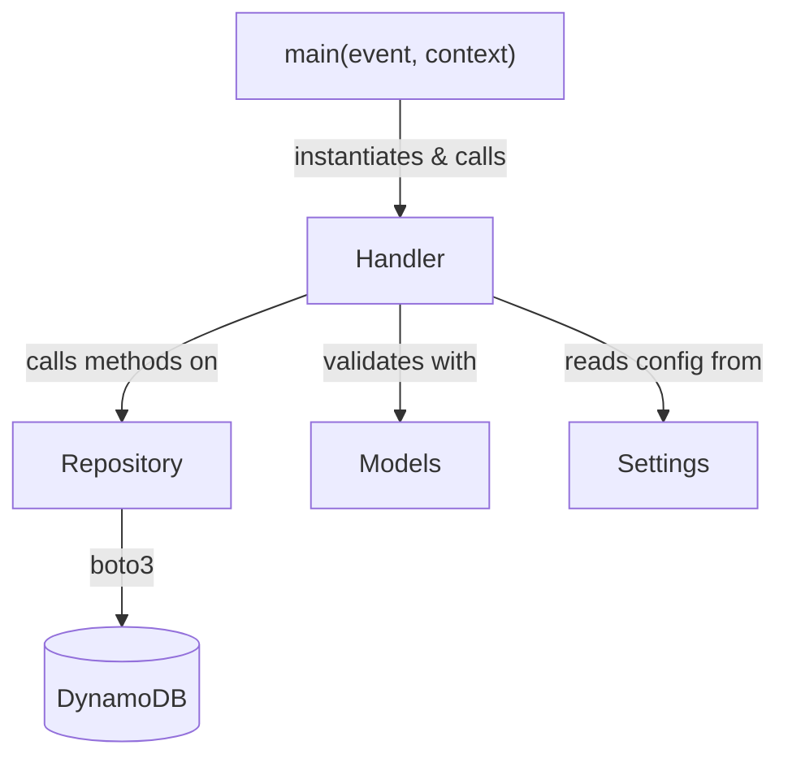

# Design Document: code-style-refactor

## Overview

This refactor standardises the code style of the `aws_lambda_template` project without introducing new runtime behaviour. The changes fall into three broad categories:

1. **Structural renames** – the top-level package becomes `template`; the two scenarios become `api` and `stream`.
2. **Pydantic / pydantic-settings idiom updates** – `Field(description=...)`, constructor-keyword config, and camelCase alias support.
3. **Architectural patterns** – a `Repository` class per scenario for DynamoDB access, and a `Handler` class wrapping all Lambda business logic with a module-level `main` entry point.

All existing tests must remain green after the refactor; they are updated in place to reflect the new names and patterns.

---

## Architecture

### Before

```
aws_lambda_template/
  app.py
  scenarios/
    api_gateway_dynamodb/
      handler.py      # module-level `handler` function is the Lambda entry point
      models.py       # plain BaseModel, no alias support
      settings.py     # model_config = SettingsConfigDict(...)
    dynamodb_stream/
      handler.py      # same pattern
      models.py       # model_config = ConfigDict(extra="allow")
      settings.py     # model_config = SettingsConfigDict(...)
```

### After

```
template/
  app.py
  scenarios/
    api/
      handler.py      # Handler class + module-level `main` entry point
      models.py       # BaseModel with populate_by_name=True, alias_generator=to_camel
      repository.py   # Repository class owning all boto3 DynamoDB calls
      settings.py     # BaseSettings with constructor-keyword config
    stream/
      handler.py
      models.py
      repository.py
      settings.py
```

### Dependency flow (per scenario)



The Powertools decorators (`@logger.inject_lambda_context`, `@tracer.capture_lambda_handler`, `@metrics.log_metrics`) are applied to `main`, not to `Handler.handle`.

---

## Components and Interfaces

### 1. Package rename: `aws_lambda_template` → `template`

All Python source files move from `aws_lambda_template/` to `template/`. Internal imports are updated accordingly. `pyproject.toml` is updated:

```toml
[tool.poetry]
name = "template"
packages = [{include = "template"}]

[tool.poetry.scripts]
app = "template.app:main"

[tool.coverage.run]
source = ["template"]
```

### 2. Scenario renames

| Old path | New path |
|---|---|
| `template/scenarios/api_gateway_dynamodb/` | `template/scenarios/api/` |
| `template/scenarios/dynamodb_stream/` | `template/scenarios/stream/` |

Infra handler strings update to:
- `template.scenarios.api.handler.main`
- `template.scenarios.stream.handler.main`

### 3. Settings classes

`model_config = SettingsConfigDict(...)` is replaced by constructor keyword arguments:

```python
# Before
class Settings(BaseSettings):
    model_config = SettingsConfigDict(case_sensitive=False)
    table_name: str
    """DynamoDB table name."""

# After
class Settings(BaseSettings, case_sensitive=False):
    table_name: str = Field(description="DynamoDB table name.")
```

### 4. Pydantic models

`model_config = ConfigDict(...)` is replaced by constructor keyword arguments, and every model gains `populate_by_name=True` and `alias_generator=to_camel`:

```python
# Before
class Item(BaseModel):
    id: str
    name: str

# After
from pydantic.alias_generators import to_camel

class Item(BaseModel, populate_by_name=True, alias_generator=to_camel):
    id: str = Field(description="Unique item identifier.")
    name: str = Field(description="Human-readable item name.")
```

`DestinationItem` (stream scenario) previously used `ConfigDict(extra="allow")`:

```python
# After
class DestinationItem(BaseModel, extra="allow", populate_by_name=True, alias_generator=to_camel):
    id: str = Field(description="Unique item identifier.")
```

### 5. Repository class

Each scenario gains a `repository.py` module with a `Repository` class that owns all `boto3` DynamoDB calls.

**`template/scenarios/api/repository.py`**

```python
class Repository:
    def __init__(self, table) -> None:
        self._table = table

    def get_item(self, item_id: str) -> dict | None:
        response = self._table.get_item(Key={"id": item_id})
        return response.get("Item")

    def put_item(self, item: dict) -> None:
        self._table.put_item(Item=item)
```

**`template/scenarios/stream/repository.py`**

```python
class Repository:
    def __init__(self, destination_table) -> None:
        self._destination_table = destination_table

    def put_item(self, item: dict) -> None:
        self._destination_table.put_item(Item=item)

    def delete_item(self, key: dict) -> None:
        self._destination_table.delete_item(Key=key)
```

### 6. Handler class and `main` entry point

All business logic moves into `Handler.handle`. The module-level `main` function instantiates `Handler` with a `Repository` and calls `handle`:

```python
# template/scenarios/api/handler.py  (sketch)

class Handler:
    def __init__(self, repository: Repository) -> None:
        self._repo = repository
        self._app = APIGatewayRestResolver()
        self._register_routes()

    def _register_routes(self) -> None:
        self._app.get("/items/<id>")(self._get_item)
        self._app.post("/items")(self._create_item)

    def handle(self, event: dict, context: LambdaContext) -> dict:
        return self._app.resolve(event, context)

    def _get_item(self, id: str) -> dict: ...
    def _create_item(self) -> tuple[dict, int]: ...


@logger.inject_lambda_context
@tracer.capture_lambda_handler
@metrics.log_metrics
def main(event: dict, context: LambdaContext) -> dict:
    repo = Repository(table)
    return Handler(repo).handle(event, context)
```

```python
# template/scenarios/stream/handler.py  (sketch)

class Handler:
    def __init__(self, repository: Repository) -> None:
        self._repo = repository

    def handle(self, event: DynamoDBStreamEvent, context: LambdaContext) -> None:
        for record in event.records:
            ...


@logger.inject_lambda_context
@tracer.capture_lambda_handler
@metrics.log_metrics
@event_source(data_class=DynamoDBStreamEvent)
def main(event: DynamoDBStreamEvent, context: LambdaContext) -> None:
    repo = Repository(destination_table)
    Handler(repo).handle(event, context)
```

### 7. Test updates

| Concern | Before | After |
|---|---|---|
| Import path | `aws_lambda_template.scenarios.api_gateway_dynamodb.handler` | `template.scenarios.api.handler` |
| Module cache flush | keys containing `api_gateway_dynamodb` / `dynamodb_stream` | keys containing `template.scenarios.api` / `template.scenarios.stream` |
| DynamoDB mock | `mocker.patch.object(handler_module, "table")` | `mocker.patch.object(handler_module.Handler, ...)` or mock `Repository` instance |
| Entry point | `handler_module.handler(event, ctx)` | `handler_module.main(event, ctx)` |

### 8. AGENTS.md updates

A new "Coding Conventions" section is added covering:
- `Field(description=...)` for all Pydantic / pydantic-settings fields
- `Handler` class + `main` entry-point pattern
- Repository pattern for DynamoDB access
- camelCase alias convention
- Updated package and scenario names in all examples

---

## Data Models

### `api` scenario

```python
# template/scenarios/api/models.py
from pydantic import BaseModel, Field
from pydantic.alias_generators import to_camel

class Item(BaseModel, populate_by_name=True, alias_generator=to_camel):
    id: str = Field(description="Unique item identifier.")
    name: str = Field(description="Human-readable item name.")
```

```python
# template/scenarios/api/settings.py
from pydantic import Field
from pydantic_settings import BaseSettings

class Settings(BaseSettings, case_sensitive=False):
    table_name: str = Field(description="DynamoDB table name.")
    service_name: str = Field(description="Powertools service name.")
    metrics_namespace: str = Field(description="Powertools metrics namespace.")
```

### `stream` scenario

```python
# template/scenarios/stream/models.py
from pydantic import BaseModel, Field
from pydantic.alias_generators import to_camel

class DestinationItem(BaseModel, extra="allow", populate_by_name=True, alias_generator=to_camel):
    id: str = Field(description="Unique item identifier.")
```

```python
# template/scenarios/stream/settings.py
from pydantic import Field
from pydantic_settings import BaseSettings

class Settings(BaseSettings, case_sensitive=False):
    source_table_name: str = Field(description="Source DynamoDB table name.")
    destination_table_name: str = Field(description="Destination DynamoDB table name.")
    service_name: str = Field(description="Powertools service name.")
    metrics_namespace: str = Field(description="Powertools metrics namespace.")
```

### Alias behaviour summary

| Call | Keys returned |
|---|---|
| `item.model_dump()` | `{"id": ..., "name": ...}` (snake_case) |
| `item.model_dump(by_alias=True)` | `{"id": ..., "name": ...}` (camelCase; single-word fields are unchanged) |
| `Item.model_validate({"itemId": ...})` | works when field is `item_id` |

---

## Correctness Properties

*A property is a characteristic or behavior that should hold true across all valid executions of a system — essentially, a formal statement about what the system should do. Properties serve as the bridge between human-readable specifications and machine-verifiable correctness guarantees.*

### Property 1: Field descriptions are stored in Field metadata

*For any* Pydantic model or pydantic-settings class in the `template` package, every field that carries a description SHALL have that description stored in the field's `FieldInfo.description` attribute (i.e. declared via `Field(description="...")`), not in a docstring or inline comment.

**Validates: Requirements 3.1, 3.2**

### Property 2: No class-level `model_config` attribute

*For any* class in the `template` package that inherits from `BaseModel` or `BaseSettings`, the class SHALL NOT define a `model_config` class attribute that is an instance of `ConfigDict` or `SettingsConfigDict`. Configuration options must be passed as constructor keyword arguments to the base class.

**Validates: Requirements 4.1, 4.2, 4.3, 4.4**

### Property 3: All Pydantic models have camelCase alias support

*For any* class in the `template` package that inherits from `BaseModel`, the class's `model_config` SHALL have `populate_by_name=True` and `alias_generator` set to `pydantic.alias_generators.to_camel`.

**Validates: Requirements 5.1, 5.5**

### Property 4: camelCase alias round-trip

*For any* Pydantic model instance in the `template` package, serialising with `model_dump(by_alias=True)` and then deserialising the result with `model_validate` SHALL produce an equivalent model instance. Additionally, `model_dump()` (no arguments) SHALL return snake_case keys, and `model_dump(by_alias=True)` SHALL return camelCase keys for multi-word field names.

**Validates: Requirements 5.2, 5.3, 5.4**

---

## Error Handling

### `api` scenario

| Situation | Behaviour |
|---|---|
| `Repository.get_item` raises | `Handler._get_item` catches, logs, returns 500 |
| Item not found in DynamoDB | `Handler._get_item` raises `NotFoundError` → 404 |
| Request body fails Pydantic validation | `Handler._create_item` catches `ValidationError`, returns 422 with error detail |
| `Repository.put_item` raises | `Handler._create_item` catches, logs, returns 500 |

### `stream` scenario

| Situation | Behaviour |
|---|---|
| `DestinationItem.model_validate` raises `ValidationError` | Caught per-record; error logged with `metrics.add_metric(ProcessingError)`; processing continues |
| `Repository.put_item` / `delete_item` raises | Caught per-record; error logged; processing continues |

Error handling logic lives inside `Handler.handle` / the route methods, not in `main`. `main` is kept thin (instantiate, delegate, return).

---

## Testing Strategy

### Dual testing approach

Both unit tests and property-based tests are required. They are complementary:

- **Unit tests** verify specific examples, integration points, and error conditions.
- **Property tests** verify universal invariants across many generated inputs.

### Property-based testing library

Use **[Hypothesis](https://hypothesis.readthedocs.io/)** (`hypothesis` package) for all property-based tests. Each property test must run a minimum of **100 iterations** (Hypothesis default is 100; do not lower it).

Tag format for each property test:

```python
# Feature: code-style-refactor, Property N: <property text>
@given(...)
def test_property_n_...(...)
```

### Unit tests (examples and error conditions)

Each test module mirrors the source module path:

| Source | Test |
|---|---|
| `template/scenarios/api/handler.py` | `tests/scenarios/api/test_handler.py` |
| `template/scenarios/stream/handler.py` | `tests/scenarios/stream/test_handler.py` |

**`api` scenario unit tests** (updated from current):
- `test_get_item_found` — GET 200 with item data
- `test_post_item_created` — POST 201 with created item
- `test_get_item_not_found` — GET 404 when item absent
- `test_post_item_invalid_body` — POST 422 on validation failure
- `test_get_item_dynamodb_error` — GET 500 on DynamoDB exception
- `test_post_item_dynamodb_error` — POST 500 on DynamoDB exception

All tests mock `Repository` instance methods rather than `boto3.resource`. Entry point is `handler_module.main`.

**`stream` scenario unit tests** (updated from current):
- `test_insert_record_calls_put_item`
- `test_modify_record_calls_put_item`
- `test_remove_record_calls_delete_item`
- `test_deserialisation_failure_continues`
- `test_dynamodb_write_failure_continues`

All tests mock `Repository` instance methods. Entry point is `handler_module.main`.

### Property-based tests

**Property 1 — Field descriptions in Field metadata**

```python
# Feature: code-style-refactor, Property 1: field descriptions stored in FieldInfo
@given(st.sampled_from([Item, DestinationItem, Settings_api, Settings_stream]))
def test_field_descriptions_in_field_info(model_cls):
    for name, field_info in model_cls.model_fields.items():
        if field_info.description is not None:
            assert isinstance(field_info.description, str)
            assert len(field_info.description) > 0
```

**Property 2 — No class-level `model_config` attribute**

```python
# Feature: code-style-refactor, Property 2: no class-level model_config attribute
@given(st.sampled_from([Item, DestinationItem, Settings_api, Settings_stream]))
def test_no_explicit_model_config_attribute(model_cls):
    assert "model_config" not in model_cls.__dict__
```

**Property 3 — camelCase alias support on all models**

```python
# Feature: code-style-refactor, Property 3: all models have populate_by_name and to_camel alias_generator
@given(st.sampled_from([Item, DestinationItem]))
def test_models_have_camel_alias_config(model_cls):
    cfg = model_cls.model_config
    assert cfg.get("populate_by_name") is True
    from pydantic.alias_generators import to_camel
    assert cfg.get("alias_generator") is to_camel
```

**Property 4 — camelCase alias round-trip**

```python
# Feature: code-style-refactor, Property 4: camelCase alias round-trip
@given(st.builds(Item))
def test_item_alias_round_trip(item):
    dumped = item.model_dump(by_alias=True)
    restored = Item.model_validate(dumped)
    assert restored == item
```

### Avoiding over-testing

Unit tests focus on concrete scenarios and error paths. Property tests handle broad input coverage. Do not duplicate coverage between the two layers.
