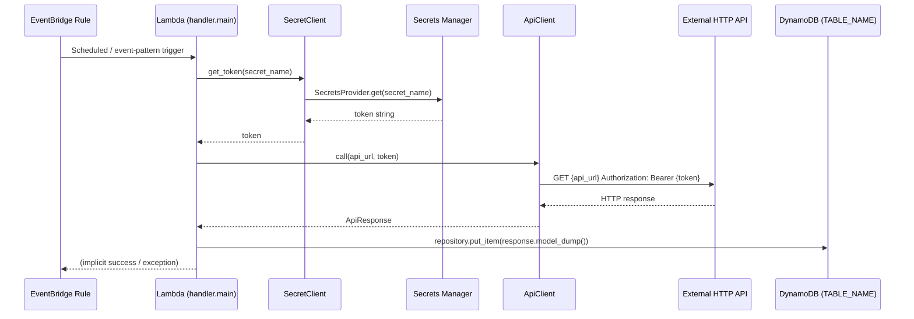

# Design Document — eventbridge-api-caller

## Overview

`eventbridge-api-caller` is a Lambda scenario template that demonstrates a function triggered by an Amazon EventBridge scheduled (or event-pattern) rule that calls an external HTTP API on every invocation. The authentication token for the API is loaded at runtime from AWS Secrets Manager via `SecretsProvider` from AWS Lambda Powertools `parameters`, so credentials are never hard-coded or stored in environment variables. The API response is persisted to a DynamoDB table using the shared `Repository` class from `templates/repository.py`.

The template follows all existing project conventions: Poetry, Pydantic v2, pydantic-settings, AWS Lambda Powertools (Logger / Tracer / Metrics), camelCase aliases, `Field(description=...)` on every field, and the same module layout used by the `api/` and `stream/` templates.

### Key design decisions

- `urllib.request` is used for outbound HTTP calls to avoid adding a third-party HTTP dependency.
- `SecretClient` and `ApiClient` are thin wrapper classes (mirroring the `Repository` pattern) so that tests can mock them at the object level rather than patching stdlib or boto3 internals.
- The `Handler` class owns the orchestration logic; the module-level `main` function is the Lambda entry point decorated with Powertools utilities.
- Metrics (`ApiCallSuccess` / `ApiCallFailure`) are emitted as CloudWatch EMF metrics via `Metrics.add_metric`.
- The shared `Repository` class from `templates/repository.py` is imported directly and initialised with `settings.table_name`; no new repository file is created.

---

## Architecture



```mermaid
graph TD
    subgraph AWS
        EB[EventBridge Rule<br/>rate(5 minutes)]
        L[Lambda Function<br/>templates.eventbridge.handler.main]
        SM[Secrets Manager<br/>SECRET_NAME]
        CW[CloudWatch Metrics<br/>METRICS_NAMESPACE]
        DB[DynamoDB Table<br/>TABLE_NAME]
    end
    EXT[External HTTP API<br/>API_URL]

    EB -->|invoke| L
    L -->|GetSecretValue| SM
    L -->|HTTP GET + Bearer| EXT
    L -->|EMF metrics| CW
    L -->|PutItem| DB
```

---

## Components and Interfaces

### `templates/eventbridge/settings.py` — `Settings`

Reads all required configuration from environment variables at cold-start using `pydantic-settings`.

```python
class Settings(BaseSettings, case_sensitive=False):
    api_url: str           = Field(description="URL of the external HTTP API to call.")
    secret_name: str       = Field(description="AWS Secrets Manager secret name holding the API token.")
    service_name: str      = Field(description="Powertools service name used for Logger and Tracer.")
    metrics_namespace: str = Field(description="CloudWatch namespace for Powertools Metrics.")
    table_name: str        = Field(description="DynamoDB table name for persisting API responses.")
```

Raises `ValidationError` on cold-start if any variable is absent.

---

### `templates/eventbridge/models.py` — `EventBridgeEvent`, `ApiResponse`

Both models use `populate_by_name=True` and `alias_generator=to_camel` so camelCase JSON payloads map to snake_case Python attributes.

```python
class EventBridgeEvent(BaseModel, populate_by_name=True, alias_generator=to_camel):
    source: str            = Field(description="Event source (e.g. 'aws.events' for scheduled rules).")
    detail_type: str       = Field(description="Human-readable event type string.")
    detail: dict[str, Any] = Field(description="Free-form event detail payload.")

class ApiResponse(BaseModel, populate_by_name=True, alias_generator=to_camel):
    status: str            = Field(description="Status string returned by the external API.")
```

`detail_type` maps to the JSON key `detailType` via `to_camel`.

---

### `templates/eventbridge/secret_client.py` — `SecretClient`

Owns all interactions with AWS Secrets Manager. Uses `SecretsProvider` from `aws_lambda_powertools.utilities.parameters`.

```python
class SecretClient:
    def __init__(self) -> None:
        self._provider = SecretsProvider()

    def get_token(self, secret_name: str) -> str:
        return self._provider.get(secret_name)
```

Raises the underlying Powertools / boto3 exception on failure; the `Handler` catches and re-raises.

---

### `templates/eventbridge/api_client.py` — `ApiClient`

Owns all outbound HTTP calls using `urllib.request`. No third-party HTTP library.

```python
class ApiClient:
    def call(self, url: str, token: str) -> dict[str, Any]:
        req = Request(url, headers={"Authorization": f"Bearer {token}"})
        with urlopen(req) as response:
            if response.status < 200 or response.status >= 300:
                raise HTTPError(...)
            return loads(response.read())
```

Raises `HTTPError` for non-2xx responses and propagates network-level exceptions (`URLError`, `TimeoutError`) unchanged.

---

### `templates/repository.py` — `Repository`

The shared DynamoDB abstraction imported directly from `templates/repository.py`. No new file is created for this scenario. The module-level singleton is initialised with `settings.table_name` and `put_item` is called with `response.model_dump()` after a successful API call.

```python
# In handler.py (module level)
from templates.repository import Repository

repository = Repository(settings.table_name)
```

`put_item` raises on any DynamoDB error; the `Handler` catches and re-raises.

---

### `templates/eventbridge/handler.py` — `Handler` + `main`

Orchestrates the invocation flow. Module-level singletons are created at cold-start; `main` is the Lambda entry point.

```python
class Handler:
    def __init__(self, secret_client: SecretClient, api_client: ApiClient, repository: Repository) -> None: ...

    @tracer.capture_method
    def handle(self, event: EventBridgeEvent) -> ApiResponse: ...

@logger.inject_lambda_context
@tracer.capture_lambda_handler
@metrics.log_metrics
def main(event: dict, context: LambdaContext) -> None:
    try:
        eb_event = EventBridgeEvent.model_validate(event)
    except ValidationError as exc:
        logger.error("Invalid EventBridge event", exc_info=exc)
        return
    handler.handle(eb_event)
```

Invocation flow inside `Handler.handle`:
1. Call `secret_client.get_token(settings.secret_name)` — raises on failure.
2. Call `api_client.call(settings.api_url, token)` — raises on non-2xx or network error.
3. Parse response into `ApiResponse`.
4a. Call `repository.put_item(response.model_dump())` — raises on failure.
5. Emit `ApiCallSuccess` metric and log success.
6. On any exception from steps 1–4a: emit `ApiCallFailure` metric, log error, re-raise.

---

### `infra/stacks/eventbridge.py` — `EventBridgeApiCallerStack`

CDK stack that provisions all required AWS resources.

```python
class EventBridgeApiCallerStack(Stack):
    # Lambda function (Runtime.PYTHON_3_13, handler=templates.eventbridge.handler.main)
    # EventBridge Rule (Schedule.rate(Duration.minutes(5)))
    # DynamoDB Table (partition_key=Attribute(name="id", type=AttributeType.STRING), RemovalPolicy.DESTROY)
    # IAM: secret.grant_read(function)
    # IAM: table.grant_write_data(function)  → dynamodb:PutItem
    # Environment: API_URL, SECRET_NAME, SERVICE_NAME, METRICS_NAMESPACE, TABLE_NAME
```

---

### `tests/eventbridge/test_handler.py`

Unit tests using `pytest` + `pytest-mock`. The `autouse` fixture sets all required env vars including `TABLE_NAME`. Tests mock `handler.secret_client`, `handler.api_client`, and `handler.repository` at the object level.

---

## Data Models

### `EventBridgeEvent`

| Python attribute | JSON key (camelCase) | Type | Description |
|---|---|---|---|
| `source` | `source` | `str` | Event source identifier |
| `detail_type` | `detailType` | `str` | Human-readable event type |
| `detail` | `detail` | `dict[str, Any]` | Free-form event detail payload |

### `ApiResponse`

| Python attribute | JSON key (camelCase) | Type | Description |
|---|---|---|---|
| `status` | `status` | `str` | Status string from the external API |

### `Settings`

| Attribute | Env var | Description |
|---|---|---|
| `api_url` | `API_URL` | External API URL |
| `secret_name` | `SECRET_NAME` | Secrets Manager secret name |
| `service_name` | `SERVICE_NAME` | Powertools service name |
| `metrics_namespace` | `METRICS_NAMESPACE` | CloudWatch metrics namespace |
| `table_name` | `TABLE_NAME` | DynamoDB table name for persisting API responses |

---

## Correctness Properties

*A property is a characteristic or behavior that should hold true across all valid executions of a system — essentially, a formal statement about what the system should do. Properties serve as the bridge between human-readable specifications and machine-verifiable correctness guarantees.*

### Property 1: Handler accepts any valid EventBridge event shape

*For any* event dict that contains the fields `source`, `detailType`, and `detail` (regardless of whether `source` is `"aws.events"` or an arbitrary custom string), `EventBridgeEvent.model_validate` should succeed and the handler should proceed to call the ApiClient.

**Validates: Requirements 1.2**

---

### Property 2: Invalid event prevents ApiClient call

*For any* event dict that is missing one or more of the required fields (`source`, `detailType`, `detail`), the handler should return without invoking `ApiClient.call`.

**Validates: Requirements 1.3**

---

### Property 3: SecretClient exception propagates

*For any* exception raised by `SecretClient.get_token`, the handler should propagate an exception (not swallow it silently), signalling a Lambda invocation failure.

**Validates: Requirements 2.3**

---

### Property 4: Bearer token header for any token string

*For any* non-empty token string, `ApiClient.call` should include an `Authorization` header whose value is exactly `"Bearer {token}"`.

**Validates: Requirements 3.2**

---

### Property 5: 2xx response parsed into ApiResponse

*For any* HTTP response body that is a valid JSON object containing a `status` field, when the HTTP status code is in the 2xx range, the handler should parse the body into an `ApiResponse` without raising.

**Validates: Requirements 3.3**

---

### Property 6: ApiClient failure propagates exception

*For any* failure raised by `ApiClient.call` — whether a non-2xx HTTP status code or a network-level exception — the handler should propagate an exception to signal a Lambda invocation failure.

**Validates: Requirements 3.4, 3.5**

---

### Property 7: Missing required env var raises ValidationError

*For any* subset of the required environment variables (`API_URL`, `SECRET_NAME`, `SERVICE_NAME`, `METRICS_NAMESPACE`, `TABLE_NAME`) that is absent, constructing `Settings()` should raise a `ValidationError`.

**Validates: Requirements 5.1, 5.2**

---

### Property 8: EventBridgeEvent camelCase round-trip

*For any* dict with camelCase keys `source`, `detailType`, and `detail`, parsing with `EventBridgeEvent.model_validate` and re-serialising with `model_dump(by_alias=True)` should produce a dict equal to the original input.

**Validates: Requirements 6.1, 6.3**

---

### Property 9: ApiResponse camelCase round-trip

*For any* dict with a `status` key, parsing with `ApiResponse.model_validate` and re-serialising with `model_dump(by_alias=True)` should produce a dict equal to the original input.

**Validates: Requirements 6.2, 6.4**

---

### Property 10: Successful API response is persisted to DynamoDB

*For any* valid `ApiResponse`, after a successful `ApiClient.call`, `repository.put_item` should be called exactly once with the response dict (`response.model_dump()`).

**Validates: Requirements 11.1**

---

### Property 11: DynamoDB write failure propagates exception

*For any* exception raised by `repository.put_item`, the handler should propagate an exception to signal a Lambda invocation failure.

**Validates: Requirements 11.4**

---

## Error Handling

| Failure scenario | Detection point | Handler behaviour |
|---|---|---|
| Invalid EventBridge event payload | `EventBridgeEvent.model_validate` raises `ValidationError` | Log error, return (no exception — not a retriable failure) |
| Secrets Manager unavailable | `SecretClient.get_token` raises | Log error, re-raise → Lambda marks invocation failed |
| External API non-2xx response | `ApiClient.call` raises `HTTPError` | Log status code, emit `ApiCallFailure` metric, re-raise |
| Network-level exception (timeout, DNS) | `ApiClient.call` raises `URLError` / `TimeoutError` | Log exception, emit `ApiCallFailure` metric, re-raise |
| DynamoDB write failure | `repository.put_item` raises | Log error, emit `ApiCallFailure` metric, re-raise |
| Missing env var at cold-start | `Settings()` raises `ValidationError` | Lambda init fails immediately; no invocation proceeds |

---

## Testing Strategy

### Dual testing approach

Both unit tests and property-based tests are used. Unit tests cover specific examples and integration wiring; property tests verify universal correctness across generated inputs.

### Unit tests (`tests/eventbridge/test_handler.py`)

Specific examples and error-path checks:

- Successful invocation: token loaded, API called, `ApiCallSuccess` metric emitted, `repository.put_item` called with response dict.
- Secret loading failure: `SecretClient.get_token` raises → handler re-raises, `ApiCallFailure` emitted.
- API non-2xx response: `ApiClient.call` raises `HTTPError` → handler re-raises.
- API network exception: `ApiClient.call` raises `URLError` → handler re-raises.
- Invalid EventBridge event: handler returns without calling `ApiClient`.
- DynamoDB write failure: `repository.put_item` raises → handler re-raises, `ApiCallFailure` emitted.

All tests use an `autouse` fixture to set env vars (including `TABLE_NAME`) via `monkeypatch.setenv`. `SecretClient`, `ApiClient`, and `repository` are mocked via `mocker.patch.object` on the module-level instances.

### Property-based tests (`tests/eventbridge/test_properties.py`)

Uses **Hypothesis** (already a dev dependency) with a minimum of 100 examples per property.

Each test is tagged with a comment in the format:
`# Feature: eventbridge-api-caller, Property {N}: {property_text}`

| Test | Property | Hypothesis strategy |
|---|---|---|
| `test_valid_event_shapes` | Property 1 | `st.text()` for source/detailType, `st.dictionaries(...)` for detail |
| `test_invalid_event_prevents_api_call` | Property 2 | `st.fixed_dictionaries` with one required key removed |
| `test_secret_exception_propagates` | Property 3 | `st.from_type(Exception)` for exception type |
| `test_bearer_token_header` | Property 4 | `st.text(min_size=1)` for token |
| `test_2xx_response_parsed` | Property 5 | `st.integers(200, 299)` for status code, `st.text()` for status field |
| `test_api_failure_propagates` | Property 6 | `st.integers(400, 599)` for non-2xx codes |
| `test_missing_env_var_raises` | Property 7 | `st.sampled_from` over required var names |
| `test_eventbridge_event_round_trip` | Property 8 | `st.text()` for source/detailType, `st.dictionaries(...)` for detail |
| `test_api_response_round_trip` | Property 9 | `st.text(min_size=1)` for status |
| `test_successful_response_persisted` | Property 10 | `st.text(min_size=1)` for status; assert `put_item` called once with `response.model_dump()` |
| `test_dynamodb_write_failure_propagates` | Property 11 | `st.from_type(Exception)` for exception raised by `put_item` |

Each property test runs `@settings(max_examples=100)`.
