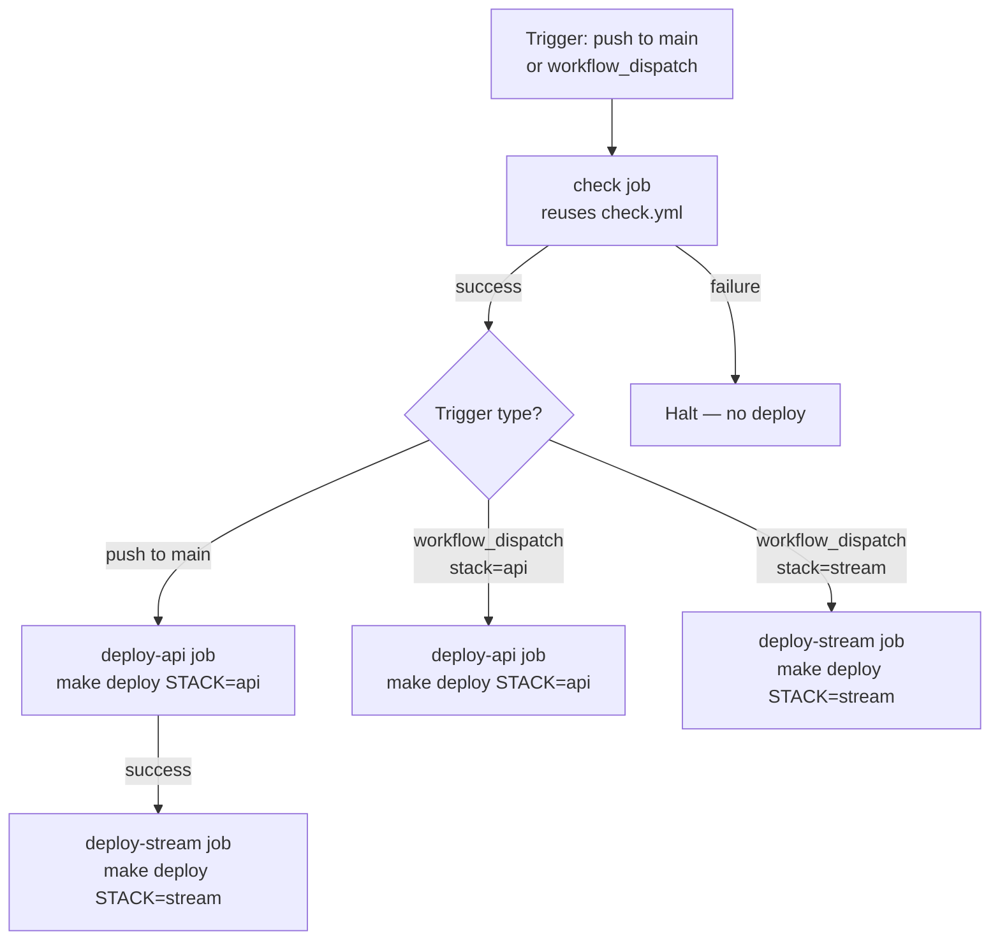

# Design Document

## Overview

This design describes a GitHub Actions deployment workflow (`deploy.yml`) for the project. The workflow automates AWS CDK stack deployments using OIDC-based authentication (no long-lived credentials), integrates with the existing `check.yml` quality gate, and supports both automatic deployment on push to `main` and manual on-demand deployment via `workflow_dispatch`.

The two deployable stacks are:
- `api` → `ApiGatewayDynamodbStack`
- `stream` → `DynamodbStreamStack`

These map directly to the `STACK_MAP_*` variables already defined in the `Makefile`.

## Architecture

The workflow is a single YAML file at `.github/workflows/deploy.yml`. It composes two logical phases:

1. **Quality Gate** — reuses `check.yml` via `workflow_call` to run lint and tests before any deployment step.
2. **Deployment** — one or two jobs (depending on trigger) that authenticate with AWS via OIDC, set up the environment, and run `make deploy STACK=<stack>`.



### Trigger Strategy

| Trigger | Stacks deployed |
|---|---|
| `push` to `main` | `api` then `stream` (sequential) |
| `workflow_dispatch` with `stack: api` | `api` only |
| `workflow_dispatch` with `stack: stream` | `stream` only |

Sequential ordering on push-to-main is enforced via `needs:` between the two deploy jobs.

### Job Conditional Logic

Each deploy job uses an `if:` expression to decide whether it should run:

- `deploy-api` runs when: trigger is `push` OR (`workflow_dispatch` AND input is `api`)
- `deploy-stream` runs when: trigger is `push` OR (`workflow_dispatch` AND input is `stream`)
- `deploy-stream` additionally has `needs: deploy-api` so it waits when both run (push to main), but the `if:` condition means it still runs independently for `workflow_dispatch stream`.

## Components and Interfaces

### Workflow File: `.github/workflows/deploy.yml`

**Triggers:**
- `push` with `branches: [main]`
- `workflow_dispatch` with a required `choice` input `stack` accepting `api` or `stream`

**Permissions (workflow-level):**
```yaml
permissions:
  id-token: write   # required for OIDC
  contents: read    # required for checkout
```

No additional permissions are granted.

**Jobs:**

| Job ID | Purpose | Depends on |
|---|---|---|
| `check` | Reuses `check.yml` via `workflow_call` | — |
| `deploy-api` | Deploys `api` stack | `check` |
| `deploy-stream` | Deploys `stream` stack | `check` (and `deploy-api` on push) |

**Reusable workflow call:**
```yaml
check:
  uses: ./.github/workflows/check.yml
```

**Deploy job steps (same structure for both stacks):**
1. `actions/checkout` — check out repository
2. `actions/setup-python` — Python 3.14
3. Install Poetry + deps — `make poetry install`
4. Install AWS CDK CLI — `npm install -g aws-cdk`
5. `aws-actions/configure-aws-credentials` — OIDC role assumption
6. `make deploy STACK=<stack>` — CDK deployment

### External Actions (pinned)

All third-party actions are pinned to a specific SHA or version tag:

| Action | Version/SHA to pin |
|---|---|
| `actions/checkout` | `v4` (pin to SHA in implementation) |
| `actions/setup-python` | `v5` (pin to SHA in implementation) |
| `aws-actions/configure-aws-credentials` | `v4` (pin to SHA in implementation) |

### Secrets and Variables

| Name | Type | Purpose |
|---|---|---|
| `AWS_DEPLOY_ROLE_ARN` | Secret | IAM role ARN assumed via OIDC |
| `AWS_REGION` | Variable | Target AWS region (e.g. `us-east-1`) |

### Environment Variables

`AWS_DEFAULT_REGION` is set at the job level to `${{ vars.AWS_REGION }}` so all steps (including CDK) pick up the correct region without explicit flags.

## Data Models

This feature is a GitHub Actions workflow — there are no runtime data models. The relevant "data" is the workflow YAML structure and the inputs/secrets it consumes.

### workflow_dispatch Input Schema

```yaml
inputs:
  stack:
    description: "CDK stack to deploy"
    required: true
    type: choice
    options:
      - api
      - stream
```

### Makefile Deploy Interface

The workflow calls `make deploy STACK=<stack>`. The Makefile maps:
- `STACK=api` → `cdk deploy ApiGatewayDynamodbStack`
- `STACK=stream` → `cdk deploy DynamodbStreamStack`

The `--require-approval never` flag must be passed to CDK. Since the Makefile's `deploy` target does not currently include this flag, it will be added to the Makefile as part of implementation.


## Correctness Properties

*A property is a characteristic or behavior that should hold true across all valid executions of a system — essentially, a formal statement about what the system should do. Properties serve as the bridge between human-readable specifications and machine-verifiable correctness guarantees.*

For a GitHub Actions workflow, "correctness" is structural: the YAML file must have the right shape. Properties are validated by parsing the workflow YAML and asserting invariants over its structure. Two categories emerge from the prework analysis:

- **Examples** — specific structural facts that must hold (a particular key exists, a particular value is set). These are best expressed as unit tests that parse the YAML and assert the expected value.
- **Properties** — universal rules that must hold across all elements of a collection (e.g., every action reference must be pinned). These are best expressed as property-based tests that iterate over all matching elements.

### Property 1: All third-party actions are pinned

*For any* action reference (`uses:` field) in the workflow YAML that references a third-party action (not a local path starting with `./`), the reference must include a pinned SHA (40-character hex string) or a version tag (e.g., `@v4`, `@v4.1.0`), and must not use a floating branch reference such as `@main` or `@master`.

**Validates: Requirements 6.4**

### Property 2: Permissions block is exactly least-privilege

*For any* top-level `permissions` block in the workflow YAML, the set of granted permissions must be exactly `{id-token: write, contents: read}` — no more, no fewer entries.

**Validates: Requirements 6.1, 6.2, 6.3**

## Error Handling

| Failure scenario | Behavior |
|---|---|
| `check` job fails (lint or test) | GitHub Actions halts all dependent jobs; deploy jobs never start |
| OIDC token exchange fails | `configure-aws-credentials` step exits non-zero; remaining steps in the job are skipped; job is marked failed |
| `make deploy` exits non-zero | GitHub Actions marks the step and job as failed; downstream jobs (e.g., `deploy-stream` after `deploy-api`) do not run |
| Unknown `STACK` value | Makefile guard (`[ -n "$(CDK_STACK)" ]`) exits 1 with an error message before CDK is invoked |
| Missing secret `AWS_DEPLOY_ROLE_ARN` | `configure-aws-credentials` receives an empty string and fails the OIDC exchange |
| Missing variable `AWS_REGION` | `aws-region` input is empty; `configure-aws-credentials` fails |

No `continue-on-error` or `if: always()` overrides are used — all failures propagate naturally.

## Testing Strategy

This feature is a GitHub Actions YAML file and a Makefile change. There is no application runtime code to unit test in the traditional sense. Instead, correctness is validated by **parsing the YAML and Makefile as data** and asserting structural properties.

### Testing Approach

**Unit tests** (pytest, `tests/test_deploy_workflow.py`):
- Parse `.github/workflows/deploy.yml` with PyYAML
- Assert specific structural facts (examples from the prework analysis)
- Each test maps to one acceptance criterion

**Property-based tests** (pytest + Hypothesis, same file):
- Iterate over collections within the parsed YAML (e.g., all `uses:` references)
- Assert universal invariants hold for every element
- Run minimum 100 iterations (Hypothesis default covers this for finite collections; for generative tests, `@settings(max_examples=100)`)

### Unit Test Cases

Each test loads the YAML once via a pytest fixture and asserts:

1. `workflow_dispatch` input `stack` exists, is required, is type `choice`, and options are `["api", "stream"]` — **Req 1.2**
2. `push` trigger is scoped to `branches: [main]` — **Req 1.1**
3. `deploy-api` job has `needs: check` and correct `if:` condition covering both push and `workflow_dispatch stack=api` — **Req 1.3, 1.4, 2.1**
4. `deploy-stream` job has `needs: [check, deploy-api]` for push ordering and correct `if:` condition — **Req 1.3, 1.4, 2.1**
5. A step in each deploy job uses `aws-actions/configure-aws-credentials` — **Req 3.1**
6. That step's `role-to-assume` is `${{ secrets.AWS_DEPLOY_ROLE_ARN }}` — **Req 3.2**
7. That step's `aws-region` is `${{ vars.AWS_REGION }}` — **Req 3.3**
8. `setup-python` step uses `python-version: "3.14"` — **Req 4.1**
9. A step runs `make poetry install` — **Req 4.2**
10. A step installs the CDK CLI (contains `aws-cdk`) — **Req 4.3**
11. The deploy step in `deploy-api` runs `make deploy STACK=api` — **Req 5.1**
12. The deploy step in `deploy-stream` runs `make deploy STACK=stream` — **Req 5.1**
13. `AWS_DEFAULT_REGION` env var is set at the job level to `${{ vars.AWS_REGION }}` — **Req 5.4**
14. Makefile `deploy` target contains `--require-approval never` — **Req 5.2**
15. Top-level `permissions` block contains `id-token: write` and `contents: read` — **Req 6.1, 6.2**

### Property-Based Test Cases

**Property 1 test** — `test_all_actions_are_pinned`:
```
# Feature: github-deploy-workflow, Property 1: all third-party actions are pinned
```
Collect all `uses:` values from every step in every job. For each value that does not start with `./`, assert the `@<ref>` portion is a 40-char hex SHA or a semver/version tag (matches `v\d+` pattern). Assert no reference ends with `@main`, `@master`, or `@HEAD`.

**Property 2 test** — `test_permissions_are_exactly_least_privilege`:
```
# Feature: github-deploy-workflow, Property 2: permissions block is exactly least-privilege
```
Load the top-level `permissions` dict. Assert it equals exactly `{"id-token": "write", "contents": "read"}` — same keys, same values, no extras.

### Test Configuration

- Library: `pytest` + `hypothesis` (already in `pyproject.toml` dev dependencies)
- PyYAML for parsing: `pip install pyyaml` or add to dev deps
- Hypothesis `@settings(max_examples=100)` on property tests
- Tests live in `tests/test_deploy_workflow.py`
- Run with `make test` (existing target)
