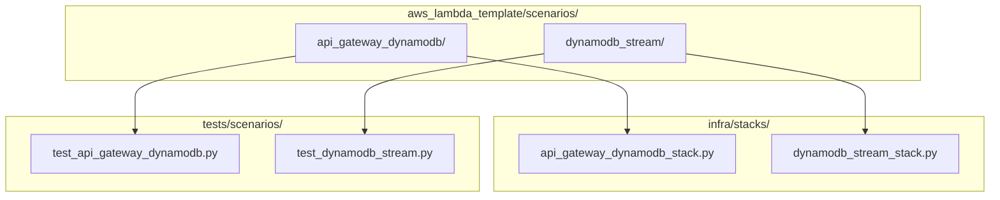
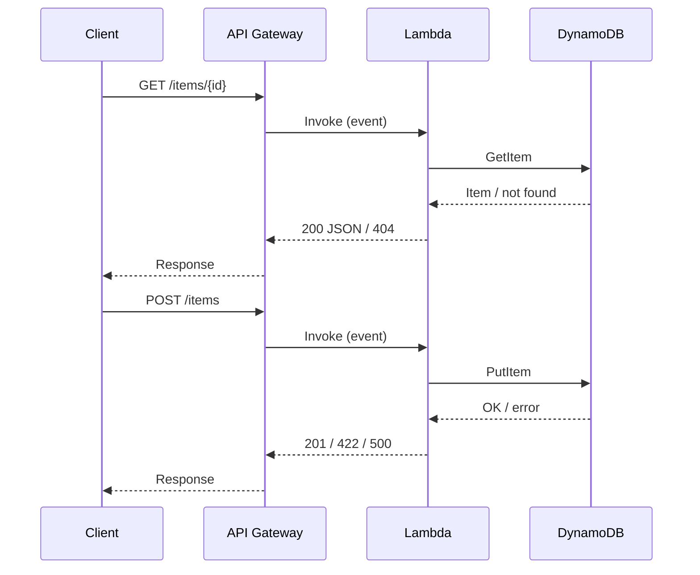
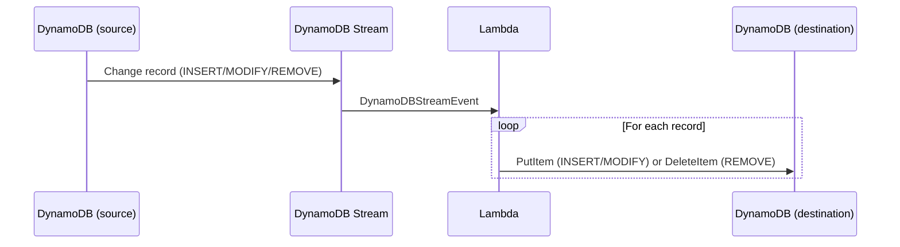

# Design Document: lambda-scenario-templates

## Overview

This feature adds two self-contained Lambda scenario templates to the project under `aws_lambda_template/scenarios/`. Each scenario is a fully-wired starting point for a common Lambda integration pattern, combining:

- AWS Lambda Powertools (Logger, Tracer, Metrics, event types, resolvers)
- Pydantic data models for domain objects
- Pydantic-settings `BaseSettings` for typed environment configuration
- AWS CDK stacks under `infra/stacks/` for infrastructure provisioning
- pytest test suites under `tests/scenarios/` with no real AWS calls

The two initial scenarios are:

1. `api_gateway_dynamodb` — API Gateway REST trigger backed by DynamoDB (CRUD)
2. `dynamodb_stream` — DynamoDB Streams trigger that fans out change records to a destination table

The directory layout is designed so that each scenario is independently copyable and new scenarios can be added without touching existing ones.

---

## Architecture



### Scenario: api_gateway_dynamodb



### Scenario: dynamodb_stream



---

## Components and Interfaces

### Shared conventions (all scenarios)

Every scenario directory follows this layout:

```
aws_lambda_template/scenarios/{scenario_name}/
    __init__.py        # exports the handler function
    handler.py         # Lambda entry point + Powertools decorators
    models.py          # Pydantic BaseModel domain objects
    settings.py        # Pydantic-settings BaseSettings subclass
```

The `handler.py` module-level initialisation pattern is:

```python
settings = Settings()                          # parsed once at cold-start
logger   = Logger(service=settings.service_name)
tracer   = Tracer(service=settings.service_name)
metrics  = Metrics(namespace=settings.metrics_namespace)
```

The handler function is decorated with:

```python
@logger.inject_lambda_context
@tracer.capture_lambda_handler
@metrics.log_metrics
def handler(event, context): ...
```

### Scenario: api_gateway_dynamodb

**`settings.py`**

| Field | Type | Env var | Description |
|---|---|---|---|
| `table_name` | `str` | `TABLE_NAME` | DynamoDB table name |
| `service_name` | `str` | `SERVICE_NAME` | Powertools service name |
| `metrics_namespace` | `str` | `METRICS_NAMESPACE` | Powertools metrics namespace |

**`models.py`**

- `Item` — Pydantic `BaseModel` with at minimum `id: str` and `name: str`; used for POST body validation and GET response serialisation.

**`handler.py`**

- Uses `APIGatewayRestResolver` from Powertools.
- Routes:
  - `GET /items/{id}` → `get_item(id: str)` — fetches from DynamoDB, returns 200 or 404.
  - `POST /items` → `create_item()` — validates body as `Item`, writes to DynamoDB, returns 201 or 422/500.
- DynamoDB client is created once at module level via `boto3.client("dynamodb")` (or `boto3.resource`).

**`infra/stacks/api_gateway_dynamodb_stack.py`**

Provisions:
- `aws_cdk.aws_dynamodb.Table` (PAY_PER_REQUEST billing, string partition key `id`)
- `aws_cdk.aws_lambda.Function` with handler pointing to the scenario
- `aws_cdk.aws_apigateway.RestApi` with a Lambda proxy integration

### Scenario: dynamodb_stream

**`settings.py`**

| Field | Type | Env var | Description |
|---|---|---|---|
| `source_table_name` | `str` | `SOURCE_TABLE_NAME` | Source DynamoDB table name |
| `destination_table_name` | `str` | `DESTINATION_TABLE_NAME` | Destination DynamoDB table name |
| `service_name` | `str` | `SERVICE_NAME` | Powertools service name |
| `metrics_namespace` | `str` | `METRICS_NAMESPACE` | Powertools metrics namespace |

**`models.py`**

- `DestinationItem` — Pydantic `BaseModel` representing the shape written to the destination table; fields derived from the source table's `NewImage`.

**`handler.py`**

- Accepts `DynamoDBStreamEvent` (Powertools event type).
- Iterates over `event.records`; for each record:
  - `INSERT` / `MODIFY` → deserialise `NewImage` into `DestinationItem`, call `put_item` on destination table.
  - `REMOVE` → extract key from `Keys`, call `delete_item` on destination table.
  - Any per-record exception → log with Logger, emit `ProcessingError` metric, continue.

**`infra/stacks/dynamodb_stream_stack.py`**

Provisions:
- Source `Table` with `stream=StreamViewType.NEW_AND_OLD_IMAGES`
- Destination `Table`
- `Function` with `DynamoDBEventSource` pointing to the source stream

---

## Data Models

### api_gateway_dynamodb

```python
from pydantic import BaseModel

class Item(BaseModel):
    id: str
    name: str
    # additional fields can be added per use-case
```

DynamoDB representation uses standard string/map attributes. The handler serialises/deserialises using `boto3`'s `TypeDeserializer` or the higher-level `resource` API.

### dynamodb_stream

```python
from pydantic import BaseModel

class DestinationItem(BaseModel):
    id: str
    # fields mirror the source table's NewImage shape
```

Stream records carry DynamoDB-typed JSON (`{"S": "value"}`). The handler uses `boto3.dynamodb.types.TypeDeserializer` to convert to plain Python dicts before constructing `DestinationItem`.

### Settings (both scenarios)

Settings classes use `pydantic_settings.BaseSettings` with `model_config = SettingsConfigDict(case_sensitive=False)`. Missing required fields raise `pydantic.ValidationError` at import time (module-level instantiation), preventing the handler from processing any event with invalid configuration.

---
