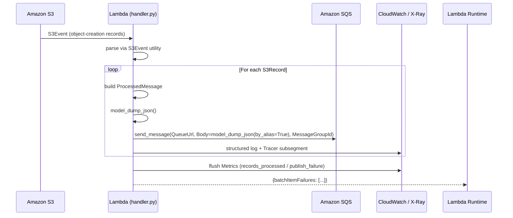

# Design Document: S3 → SQS Lambda Template

## Overview

This feature adds `templates/s3/` — a reusable Lambda function that receives S3 object-creation events, transforms each record into a typed `ProcessedMessage`, and publishes it to an SQS queue. It follows the established `templates/<name>/` pattern (a `handler.py` entry point and a `settings.py` using `pydantic-settings`) and is fully instrumented with AWS Lambda Powertools (Logger, Tracer, Metrics, S3Event).

The module is intentionally self-contained so it can be copied as a starting point for any S3-triggered, SQS-publishing Lambda.

---

## Architecture



The handler is decorated with `@logger.inject_lambda_context`, `@tracer.capture_lambda_handler`, and `@metrics.log_metrics` so all cross-cutting concerns are handled by Powertools without manual boilerplate.

---

## Components and Interfaces

### `templates/s3/settings.py`

```python
from pydantic import Field
from pydantic_settings import BaseSettings


class Settings(BaseSettings, case_sensitive=False):
    sqs_queue_url: str = Field(description="SQS queue URL to publish processed messages to")
    aws_region: str = Field(default="us-east-1", description="AWS region for the SQS client")
    powertools_service_name: str = Field(default="s3-sqs-processor", description="Powertools service name")
    log_level: str = Field(default="INFO", description="Log level for the Lambda Logger")
```

Instantiated once at module load: `settings = Settings()`. A missing `SQS_QUEUE_URL` raises `pydantic_settings.ValidationError` before the handler is ever invoked.

### `templates/s3/handler.py`

Public interface: a single Lambda entry point `lambda_handler(event, context)`.

Internal helpers (unit-testable in isolation):

| Function | Responsibility |
|---|---|
| `_parse_event(event)` | Wraps `S3Event(data=event)`, raises `ValueError` on failure |
| `_build_message(record)` | Constructs a `ProcessedMessage` from an `S3Record` |
| `_publish(msg, bucket)` | Calls `sqs_client.send_message`; raises on error |
| `lambda_handler` | Orchestrates the above; collects `batchItemFailures` |

### `ProcessedMessage` (Pydantic model, defined in `handler.py` or a sibling `models.py`)

```python
from enum import StrEnum

from pydantic import BaseModel, Field
from pydantic.alias_generators import to_camel


class EventSource(StrEnum):
    s3 = "s3"


class ProcessedMessage(BaseModel, populate_by_name=True, alias_generator=to_camel):
    bucket: str = Field(description="S3 bucket name")
    key: str = Field(description="S3 object key")
    event_time: str = Field(description="ISO-8601 event timestamp")
    source: EventSource = Field(description="Origin event source")
```

### SQS client

A module-level `boto3.client("sqs", region_name=settings.aws_region)` instance, reused across invocations.

---

## Data Models

### Input: S3 Event (AWS canonical shape)

Parsed by `aws_lambda_powertools.utilities.data_classes.S3Event`. Each record exposes:
- `s3.bucket.name` → `bucket: str`
- `s3.object.key` → `key: str`
- `event_time` → ISO-8601 string

### Output: `ProcessedMessage` (JSON string sent to SQS)

```json
{
  "bucket": "my-bucket",
  "key": "path/to/object.csv",
  "event_time": "2025-01-15T10:30:00+00:00",
  "source": "s3"
}
```

### Lambda response: partial batch failure format

```json
{
  "batchItemFailures": [
    {"itemIdentifier": "path/to/failed-object.csv"}
  ]
}
```

`itemIdentifier` is the object key of the failed record.

---

## Correctness Properties

*A property is a characteristic or behavior that should hold true across all valid executions of a system — essentially, a formal statement about what the system should do. Properties serve as the bridge between human-readable specifications and machine-verifiable correctness guarantees.*

### Property 1: Record count preservation

*For any* non-empty list of valid S3 records (1–20), the number of SQS messages published by the handler SHALL equal the number of input records.

**Validates: Requirements 1.1, 7.2, 7.5**

### Property 2: Invalid event raises ValueError

*For any* payload that is not a valid S3 event shape (missing required keys, wrong types), the handler SHALL raise a `ValueError` and publish zero SQS messages.

**Validates: Requirements 1.3**

### Property 3: Missing SQS_QUEUE_URL raises ValidationError

*For any* environment where `SQS_QUEUE_URL` is absent or empty, instantiating `Settings` SHALL raise a `pydantic_settings.ValidationError` before the handler runs.

**Validates: Requirements 2.5, 7.6**

### Property 4: ProcessedMessage serialization round-trip

*For any* valid `ProcessedMessage` instance, calling `.model_dump_json()` and then parsing the result with `ProcessedMessage.model_validate_json()` SHALL produce an object equal to the original.

**Validates: Requirements 3.1, 3.2**

### Property 5: MessageGroupId equals bucket name

*For any* S3 record with a given bucket name, the `MessageGroupId` attribute of the corresponding SQS `send_message` call SHALL equal that bucket name.

**Validates: Requirements 4.2**

### Property 6: Partial batch failure independence

*For any* batch of S3 records where a random subset fails to publish (mocked SQS errors), the handler SHALL:
1. Still publish all non-failing records to SQS.
2. Return a `batchItemFailures` list containing exactly the object keys of the failed records.
3. Not raise an unhandled exception.

**Validates: Requirements 6.1, 6.2, 6.3, 6.4, 7.3**

### Property 7: Non-idempotent double invocation

*For any* valid S3 event with N records, invoking the handler twice with the same event SHALL result in exactly 2×N SQS messages in the queue (each invocation publishes independently).

**Validates: Requirements 7.4**

### Property 8: records_processed metric equals success count

*For any* batch of N records where M fail, the `records_processed` metric value emitted by the handler SHALL equal N − M.

**Validates: Requirements 4.4**

---

## Error Handling

| Failure scenario | Handler behaviour |
|---|---|
| Unparseable S3 event | Log error via Logger, raise `ValueError` — propagates to Lambda runtime (triggers retry / DLQ) |
| `ProcessedMessage` construction fails | Log error, add key to `batchItemFailures`, continue |
| `sqs.send_message` raises | Log error, increment `publish_failure` metric, add key to `batchItemFailures`, continue |
| `SQS_QUEUE_URL` missing at cold start | `Settings` raises `ValidationError` — Lambda init fails, no invocations proceed |

Per-record failures never abort the batch. Only a completely unparseable event propagates as an exception to the runtime.

---

## Testing Strategy

### Tools

- **pytest** — test runner
- **Hypothesis** — property-based testing (`@given` + `@settings`)
- **moto** (`mock_aws`) — SQS mocking; define a local `sqs` fixture using `mock_aws` (no `moto_aws` autouse fixture exists in `tests/conftest.py`)
- **monkeypatch** — inject environment variables (never modify `os.environ` directly in test bodies)

### Test file

`tests/s3/test_handler.py`

### Unit tests (example-based)

- `Settings` defaults (aws_region, powertools_service_name, log_level)
- `Settings` with all env vars overridden
- `_build_message` produces correct fields for a concrete S3 record
- Handler returns empty `batchItemFailures` for a single valid record
- Handler logs structured fields per record (mock Logger)
- `send_message` failure → record appears in `batchItemFailures`, handler does not raise
- Zero-record event → handler returns, zero SQS messages

### Property-based tests (Hypothesis, minimum 100 iterations each)

Each property test is tagged with a comment referencing the design property.

```
# Feature: s3-sqs-lambda-template, Property 1: Record count preservation
# Feature: s3-sqs-lambda-template, Property 2: Invalid event raises ValueError
# Feature: s3-sqs-lambda-template, Property 3: Missing SQS_QUEUE_URL raises ValidationError
# Feature: s3-sqs-lambda-template, Property 4: ProcessedMessage serialization round-trip
# Feature: s3-sqs-lambda-template, Property 5: MessageGroupId equals bucket name
# Feature: s3-sqs-lambda-template, Property 6: Partial batch failure independence
# Feature: s3-sqs-lambda-template, Property 7: Non-idempotent double invocation
# Feature: s3-sqs-lambda-template, Property 8: records_processed metric equals success count
```

Hypothesis strategies needed:
- `s3_record_strategy` — generates dicts with random but valid bucket names (S3 naming rules) and object keys
- `invalid_event_strategy` — generates arbitrary dicts that lack the S3 event structure
- `processed_message_strategy` — generates `ProcessedMessage` instances with random field values

### Integration / smoke checks

- Verify `@logger.inject_lambda_context`, `@tracer.capture_lambda_handler`, `@metrics.log_metrics` decorators are present (code inspection or import-time check)
- Verify `settings = Settings()` is at module level (not inside `lambda_handler`)
- Verify no `os.environ` / `os.getenv` calls in `handler.py` or `settings.py`
