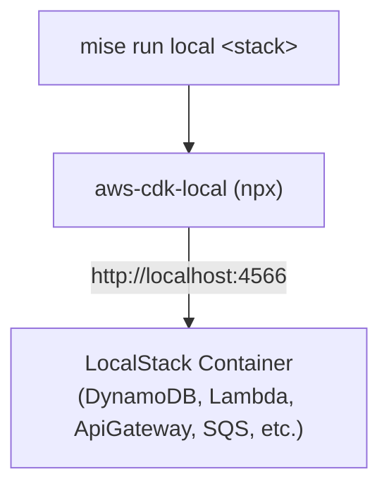

# Design: Deploy Lambda Stacks to Local via LocalStack

## System Architecture

## Component Design

### 1. `.env.local.example` & `compose.yml`

- `.env.local.example`: Template configuration file defining `LOCALSTACK_AUTH_TOKEN`, local AWS credentials, and endpoint URLs.
- `compose.yml`: Standard LocalStack Docker Compose service configuration mapping port `4566` (LocalStack Gateway) and volume mounts for persistence, loaded via `--env-file .env.local`.

### 2. `mise.toml`

Adds the following task configurations:

- `tasks."local:up"`: Launches LocalStack via `docker compose --env-file .env.local up -d --wait localstack`.
- `tasks."local:down"`: Stops LocalStack via `docker compose --env-file .env.local down localstack`.
- `tasks."local:deploy"`: Executes `STACK=$usage_stack npx --package=aws-cdk --package=aws-cdk-local cdklocal deploy --require-approval=never`.
  - Aliases: `local`, `dl`
  - Depends on: `install-cdk`, `local:up`
- `tasks."local:destroy"`: Executes `STACK=$usage_stack npx --package=aws-cdk --package=aws-cdk-local cdklocal destroy --force`.
  - Alias: `Dl`
  - Depends on: `install-cdk`, `local:up`
- `tasks.docs-local`: Serves MkDocs documentation (`uv run mkdocs serve`).

### 3. Documentation (`docs/README.md`, `AGENTS.md`)

- Instruct copying `.env.local.example` to `.env.local` and obtaining auth token from `app.localstack.cloud`.
- Add LocalStack under Prerequisites and Setup sections.
- Update shell aliases and common commands tables.
- Add step-by-step instructions to start LocalStack and deploy stacks locally.
