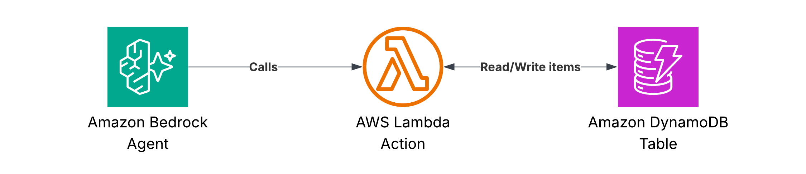

# Bedrock Agent

This template demonstrates how to handle Amazon Bedrock Agent events using function-based actions.

## Architecture

The template sets up:

1.  **Amazon Bedrock Agent**: Orchestrates user requests and identifies tool usage.
2.  **AWS Lambda function**: Resolves function calls using `BedrockAgentFunctionResolver`.
3.  **Amazon DynamoDB table**: Stores and retrieves items used by the agent.



## Code

- **Function code**: [`templates/agent`](/templates/agent)
- **Unit tests**: [`tests/agent`](/tests/agent)
- **Infra stack**: [`infra/stacks/agent.py`](/infra/stacks/agent.py)

## Deployment

Deploy the stack using:

```bash
make deploy STACK=agent
```

## Features

- **Function-based Actions**: Uses the `@app.tool()` decorator to expose functions to Bedrock Agents.
- **Automatic Parameter Mapping**: Maps Bedrock Agent parameters directly to Python function arguments.
- **Type Safety**: Uses Pydantic models for data validation and camelCase alias conversion.
- **Observability**: Integrated with AWS Lambda Powertools for logging, tracing, and metrics.

## Usage

### Define Tools

Use the `@app.tool()` decorator to define tools that the agent can call:

```python
@app.tool(name="getItem", description="Gets item details by ID")
def get_item(item_id: str) -> dict:
    return handler.get_item(item_id)
```


### Item model

Field | Type | Description
--- | --- | ---
`id` | UUID string | Unique item identifier (auto-generated)
`name` | string | Human-readable item name
`description` | string | Human-readable item description


### Environment variables

Variable | Description
--- | ---
`TABLE_NAME` | DynamoDB table name
`SERVICE_NAME` | Powertools service name
`METRICS_NAMESPACE` | Powertools metrics namespace
