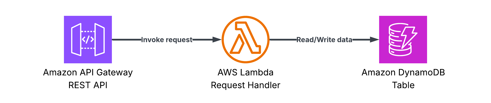

# REST API
A Lambda function that handles GET/POST requests from a REST API and loads/stores records into a DynamoDB table.

## Architecture

The template sets up:

1.  **API Gateway - REST API**: Receives requests from the user.
2.  **AWS Lambda function**: Handles user requests.
3.  **Amazon DynamoDB table**: Stores and retrieves items as per the user request.



## Code

- **Function code**: [`templates/api`](/templates/api)
- **Unit tests**: [`tests/api`](/tests/api)
- **Infra stack**: [`infra/stacks/api.py`](/infra/stacks/api.py)

## Deployment

Deploy the stack using:

```bash
mise run deploy api
```

### Endpoints

Endpoint | Description | Response codes
--- | --- | ---
`GET /items/{id}` | Retrieve an item by ID | 200 (OK), 404 (Not Found), 500 (Internal Server Error)
`POST /items` | Create a new item | 201 (Created), 422 (Unprocessable Entity), 500 (Internal Server Error)

### Item model

Field | Type | Description
--- | --- | ---
`id` | UUID string | Unique item identifier (auto-generated, 1-50 chars)
`name` | string | Human-readable item name (1-100 chars)

### Environment variables

Variable | Description | Required | Default
--- | --- | --- | ---
`TABLE_NAME` | DynamoDB table name | Yes | -
`SERVICE_NAME` | Powertools service name | No | `rest-api`
`METRICS_NAMESPACE` | Powertools metrics namespace | No | `RestApi`
