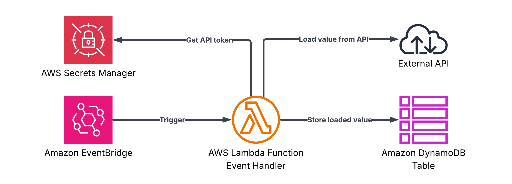

# EventBridge — API Caller
A Lambda function triggered by an Amazon EventBridge rule that loads an authentication token from AWS Secrets Manager, calls an external HTTP API, and persists the response to a DynamoDB table.

## Architecture

The template sets up:

1.  **Amazon EventBridge rule**: Triggers the function based on a schedule or event pattern.
2.  **AWS Lambda function**: Loads secrets, calls the external API, and saves the response.
3.  **AWS Secrets Manager**: Securely stores the API authentication token.
4.  **Amazon DynamoDB table**: Persists the API responses.




## Code
- **Function code**: [`templates/eventbridge`](/templates/eventbridge)
- **Unit tests**: [`tests/eventbridge`](/tests/eventbridge)
- **Infra stack**: [`infra/stacks/eventbridge.py`](/infra/stacks/eventbridge.py)

## Deployment

Deploy the stack using:

```bash
make deploy STACK=eventbridge
```

### Data models

Model | Description
--- | ---
`EventBridgeEvent` | Incoming EventBridge event payload (`source`, `detail_type`, `detail`)
`ApiResponse` | Response from the external HTTP API (`status`)
`Settings` | Runtime configuration from environment variables

### Environment variables

Variable | Description
--- | ---
`API_URL` | URL of the external HTTP API to call
`SECRET_NAME` | AWS Secrets Manager secret name holding the API token
`SERVICE_NAME` | Powertools service name
`METRICS_NAMESPACE` | CloudWatch metrics namespace
`TABLE_NAME` | DynamoDB table name for persisting API responses
