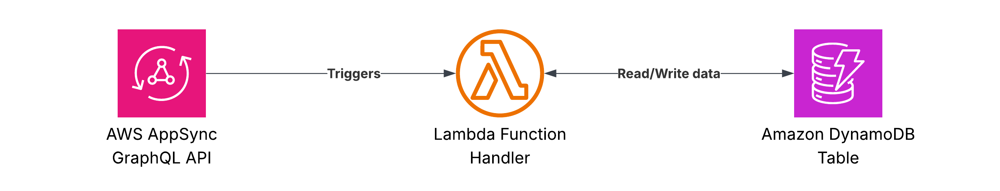

# GraphQL API

This template demonstrates how to build a GraphQL API using AWS AppSync and Lambda.

## Architecture

The template sets up:

1.  **AWS AppSync GraphQL API**: The entry point for GraphQL requests.
2.  **AWS Lambda function**: Processes GraphQL resolvers for `getItem`, `listItems`, and `createItem`.
3.  **Amazon DynamoDB table**: Stores the items.



## Code

- **Function code**: [`templates/graphql`](/templates/graphql)
- **Unit tests**: [`tests/graphql`](/tests/graphql)
- **Infra stack**: [`infra/stacks/graphql.py`](/infra/stacks/graphql.py)

## Deployment

Deploy the stack using:

```bash
mise run deploy graphql
```

## Implementation

The Lambda function uses [AppSyncResolver](https://docs.aws.amazon.com/powertools/python/latest/core/event_handler/appsync/) to route GraphQL requests to Python functions.

### Schema

The GraphQL schema is defined in `templates/graphql/schema.graphql`:

```graphql
schema {
    query: Query
    mutation: Mutation
}

type Query {
    getItem(id: ID!): Item
    listItems: [Item]
}

type Mutation {
    createItem(name: String!): Item
}

type Item {
    id: ID!
    name: String!
}
```

### Handler

The handler in `templates/graphql/handler.py` implements the resolvers:

```python
@app.resolver(type_name="Query", field_name="getItem")
def get_item(id: str) -> dict | None:
    return repository.get_item(id)

@app.resolver(type_name="Query", field_name="listItems")
def list_items() -> list[dict]:
    return repository.list_items()

@app.resolver(type_name="Mutation", field_name="createItem")
def create_item(name: str) -> dict:
    item = Item(name=name)
    repository.put_item(item.model_dump())
    return item.dump()
```
