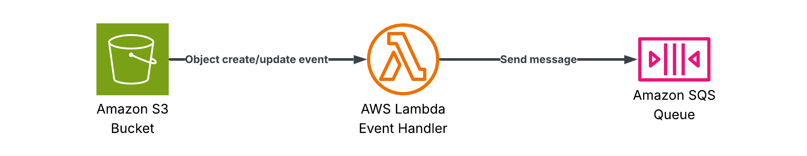

# S3 to SQS
A Lambda function that receives S3 object-creation events, transforms each record into a typed `ProcessedMessage`, and publishes it to an SQS queue.

- **Trigger**: S3 Bucket (Object Created)
- **Destination**: SQS Queue (Standard or FIFO)



## Code

- **Function code**: [`templates/s3`](/templates/s3)
- **Unit tests**: [`tests/s3`](/tests/s3)
- **Infra stack**: [`infra/stacks/s3.py`](/infra/stacks/s3.py)

## Deployment

Deploy the stack using:

```bash
make deploy STACK=s3
```

### ProcessedMessage model

Field | Type | Description
--- | --- | ---
`bucket` | string | S3 bucket name
`key` | string | S3 object key
`event_time` | string | ISO-8601 event timestamp
`source` | string | Origin event source (`s3`)

### Environment variables

Variable | Description
--- | ---
`SQS_QUEUE_URL` | SQS queue URL to publish processed messages to
`SERVICE_NAME` | Powertools service name
`LOG_LEVEL` | Log level for the Lambda Logger
