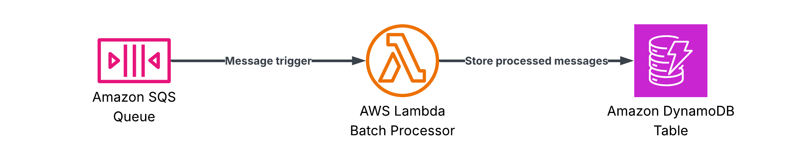

# SQS — Batch Processing
A Lambda function that handles SQS messages by batch processing them and storing the processed results into a DynamoDB table.
Partial batch failure reporting is enabled so that individual record failures do not cause the entire batch to be retried.

## Architecture

The template sets up:

1.  **Amazon SQS queue**: Holds the incoming messages to be processed.
2.  **AWS Lambda function**: Processes messages in batches with partial failure reporting.
3.  **Amazon DynamoDB table**: Stores the processed items.



## Code

- **Function code**: [`templates/sqs`](/templates/sqs)
- **Unit tests**: [`tests/sqs`](/tests/sqs)
- **Infra stack**: [`infra/stacks/sqs.py`](/infra/stacks/sqs.py)

## Deployment

Deploy the stack using:

```bash
mise run deploy sqs
```

### Data models

Model | Description
--- | ---
`SqsMessage` | Parsed from the SQS message body (`id`, `content`)
`ProcessedItem` | Written to the DynamoDB table (`id`, `content`, `status`)

### Environment variables

Variable | Description
--- | ---
`TABLE_NAME` | Destination DynamoDB table name
`SERVICE_NAME` | Powertools service name
`METRICS_NAMESPACE` | Powertools metrics namespace
